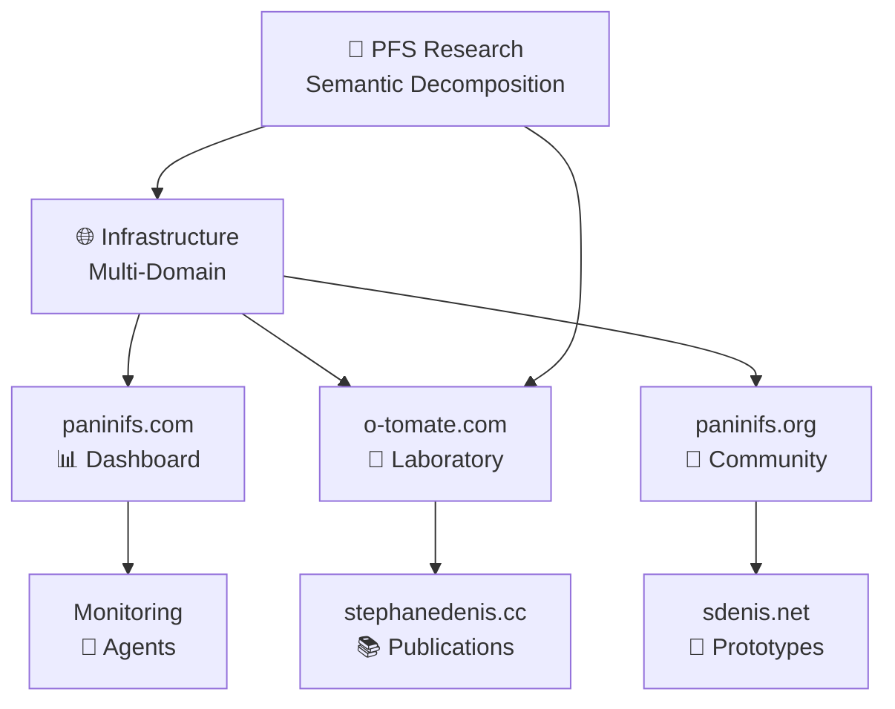

# Pāṇini File System

  
  
  **Metalinguistic information processing and storage**
  
  
  
  

## 🧠 Fundamental Vision

The **Pāṇini File System** aims to provide **intelligent storage** through a virtual file system capable of **analyzing and decomposing all information** down to the atomic semantic level when possible.

In the short term, it acts as a **deduplication/compression system**, but the idea is to build a **knowledge base** of atomic content and their respective grammars to **regenerate any stored content and even more**.

By building **private and public dictionaries** of concepts and grammars, this facilitates all aspects of **common knowledge discovery** while protecting only the non-public knowledge base as a **private semantic digest**.

## 🎯 Beyond Text

!!! question "Just for text?"
    **No!** As long as a file is structured and decomposable, it can be processed on writing to PFS and regenerated on demand.

### 🎥 Example: MP4 File

An MP4 video file is a **container with metadata**, potentially multiple audio tracks, subtitles and organized video content. This video content uses a **compression scheme** with standard image blocks, key frames, redundant and moving blocks, etc.

All this content can be **decomposed even further** to the point where some redundant information is **common with other files**. That's where the fun begins!

### 🔗 Multi-Dimensional Relationships

**Relationships can be established** on many aspects of the file and its different levels of structure:
- Its **grammar**
- Its **sub-grammars**
- Its **semantic content**

Everything needs to be stored conveniently to **find these matches** independently of the original format and even the context.

## 🚀 Experimental Approach

### 📝 Why Start with Text?

Text is a good candidate to start the project because:
- It's what we use to **code**
- It makes **debugging** much easier
- Moving to other content by **synesthetic association** to the closest textual abstract primitives

!!! tip "Natural Evolution"
    **Translated text** → Generic abstract primitives → **Multilingual movies** with subtitles → **Images in motion**

### 🤖 Manual Coding vs AI

**A bit of both probably!** This is experimental and all approaches are welcome.

=== "Manual Approach"
    **Proof of concept** - Best for:
    
    - 🏗️ Refining data structures
    - 🔧 System foundations
    - 🎯 Precise grammar control

=== "AI Generation"
    **Compiled autoencoders** - Potential for:
    
    - 🚀 Going beyond compression
    - 🧠 Automatic pattern discovery
    - 📈 Massive scalability

## 🌐 Modern Infrastructure

Alongside fundamental research, PFS relies on **modern infrastructure**:

### 🏗️ Multi-Domain Ecosystem

### 🔬 Active Laboratory

- **Prototypes** of semantic decoders
- **Multi-format** experiments
- **Automatic grammar** testing
- **PFS concept** validation

## 📊 Current State

!!! success "Solid Foundations"
    Operational infrastructure with:
    
    - ✅ **5 domains** configured
    - ✅ **Autonomous monitoring** 24/7
    - ✅ **Active research** on decomposition
    - ✅ **Community** in formation

!!! experiment "Ongoing Research"
    Development of core components:
    
    - 🔄 **Decomposition grammars**
    - 🔄 **Multi-format decoders**
    - 🔄 **Atomic semantic** base
    - 🔄 **Regeneration algorithms**

## 🤝 Research Contribution

The project **welcomes any contribution** for:

- 🧠 **Defining new decomposition grammars**
- 🔬 **Testing semantic compression algorithms**
- 📝 **Documenting linguistic discoveries**
- 🤖 **Developing automatic decoders**

---

  <strong>Pāṇini File System</strong> - From intelligent storage to universal semantic understanding
  
  Experimental research by [Stéphane Denis](https://github.com/stephanedenis)

