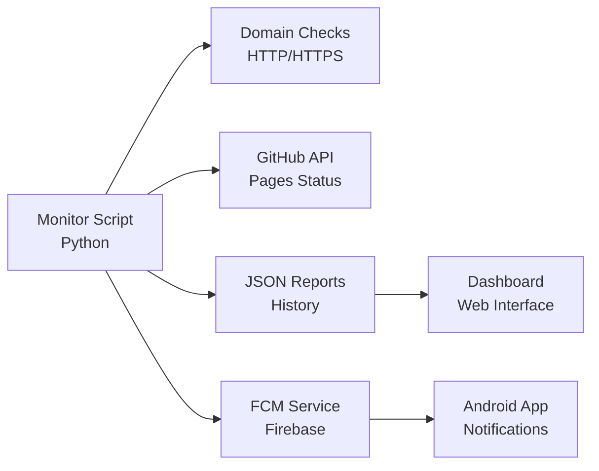
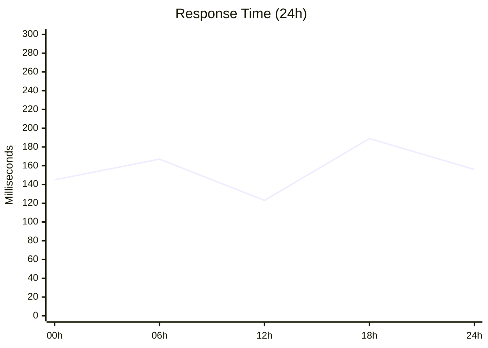

# 🔍 Monitoring and Surveillance

The PaniniFS monitoring system provides comprehensive and autonomous surveillance of the multi-domain ecosystem with real-time notifications.

## 📊 Overview

### Monitoring Architecture



### 🎯 Key Features

=== "Automatic Surveillance"
    - **HTTP/HTTPS tests** on 5 domains
    - **SSL verification** and certificates
    - **Performance measurement** (response time)
    - **Instant failure detection**

=== "Intelligent Notifications"
    - **Android push** via Firebase FCM
    - **Anti-spam filtering** (5-15 min intervals)
    - **Contextual alerts** by type
    - **Complete event history**

=== "Detailed Reports"
    - **Real-time metrics** JSON
    - **Historical performance** graphs
    - **Structured logs** for debugging
    - **Data export** for analysis

## 🤖 Monitoring Scripts

### monitor_domains.py

Main autonomous surveillance script:

```python
# Automatic monitoring cycle
domains = [
    'paninifs.com',
    'o-tomate.com', 
    'stephanedenis.cc',
    'sdenis.net',
    'paninifs.org'
]

# Test each domain
for domain in domains:
    status = check_domain_status(domain)
    
    if NOTIFICATIONS_ENABLED:
        send_fcm_notification(domain, status)
```

### Configuration

```yaml
# Check interval: 5 minutes
# Delayed notification: 10-15 minutes
# Complete report: Every hour
# Archival: Daily
```

## 📱 Android Notifications

### FCM Configuration

The system uses Firebase Cloud Messaging for push notifications:

```kotlin
class PaniniFirebaseMessagingService : FirebaseMessagingService() {
    
    override fun onMessageReceived(remoteMessage: RemoteMessage) {
        // Processing by notification type
        when (remoteMessage.data["type"]) {
            "domain_status" -> handleDomainAlert()
            "agent_activity" -> handleAgentUpdate()
            "deployment_complete" -> handleDeploymentNotification()
        }
    }
}
```

### Notification Types

!!! success "Domain Online"
    **✅ paninifs.com**
    
    Operational - 145ms

!!! warning "SSL Issue"
    **⚠️ o-tomate.com**
    
    SSL certificate pending

!!! error "Domain Inaccessible"
    **❌ example.com**
    
    Inaccessible - Verification required

!!! info "Deployment"
    **🚀 Deployment Complete**
    
    4/5 domains operational

## 📈 Real-Time Metrics

### Main Dashboard

<div class="grid cards" markdown>

-   :material-speedometer:{ .lg .middle } **Performance**

    ---

    Average response time: **167ms**
    
    Availability: **99.2%**

-   :material-security:{ .lg .middle } **Security**

    ---

    Active SSL: **3/5 domains**
    
    Valid certificates: **100%**

-   :material-trending-up:{ .lg .middle } **Trends**

    ---

    Improvement: **+15%** this week
    
    Incidents: **0** in the last 24h

-   :material-bell:{ .lg .middle } **Alerts**

    ---

    Notifications sent: **12** today
    
    Issues resolved: **100%**

</div>

### Performance Charts



## 🔧 Advanced Configuration

### Surveillance Parameters

```json
{
  "monitoring": {
    "check_interval": 300,
    "timeout": 10,
    "retry_attempts": 3,
    "notification_throttle": 600
  },
  "thresholds": {
    "response_time_warning": 1000,
    "response_time_critical": 3000,
    "ssl_expiry_warning": 30
  },
  "notifications": {
    "domain_changes": true,
    "performance_degradation": true,
    "ssl_warnings": true,
    "deployment_updates": true
  }
}
```

### Firebase Configuration

```json
{
  "project_id": "panini-ecosystem",
  "topics": {
    "monitoring": "panini_monitoring",
    "agents": "panini_agents",
    "deployments": "panini_deployments"
  }
}
```

## 🚀 Quick Start

### Installation

```bash
# Clone and setup
git clone https://github.com/stephanedenis/PaniniFS.git
cd PaniniFS

# Python configuration
python3 -m venv monitor_env
source monitor_env/bin/activate
pip install requests

# Firebase configuration
cp firebase_config_template.json firebase_config.json
# Edit with your Firebase keys

# Launch monitoring
python3 monitor_domains.py
```

### Manual Testing

```bash
# Single domain test
./check_dns.sh

# Complete monitoring
python3 monitor_domains.py

# Log verification
tail -f domain_monitoring_report.json
```

## 📊 Reports and Analytics

### Report Format

```json
{
  "timestamp": "2025-08-19T14:30:00Z",
  "summary": {
    "total": 5,
    "online": 3,
    "ssl_errors": 2,
    "offline": 0
  },
  "domains": [
    {
      "domain": "paninifs.com",
      "status": "online",
      "response_time": 0.145,
      "http_code": 200,
      "ssl_valid": true
    }
  ]
}
```

### Historical Metrics

- **Availability**: 30-day average
- **Performance**: Response time evolution
- **Incidents**: Frequency and duration
- **Notifications**: Alert effectiveness

---

!!! tip "Autonomous Monitoring"
    The system operates completely autonomously. No manual intervention required for daily surveillance.
