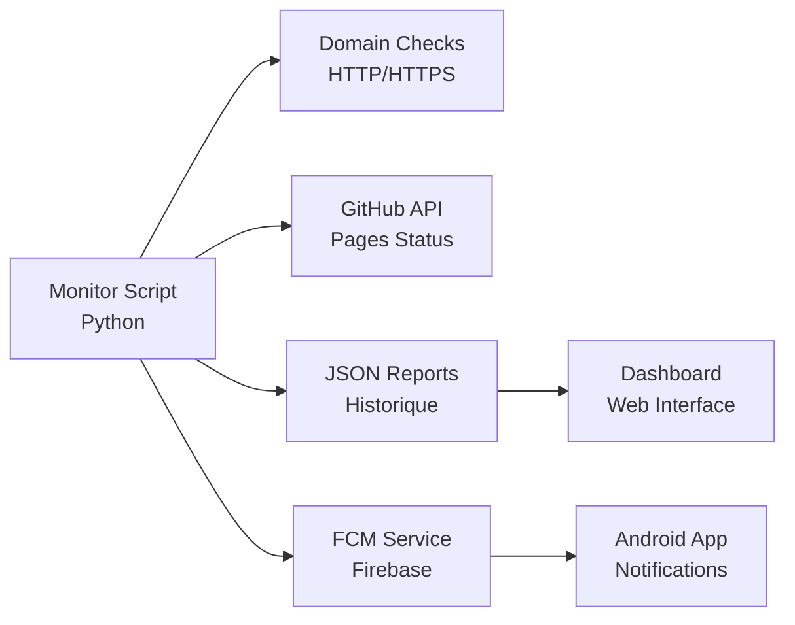
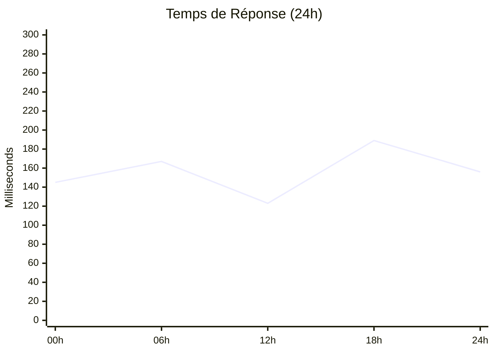

# 🔍 Monitoring et Surveillance

Le système de monitoring PaniniFS offre une surveillance complète et autonome de l'écosystème multi-domaines avec notifications en temps réel.

## 📊 Vue d'ensemble

### Architecture de Monitoring



### 🎯 Fonctionnalités Clés

=== "Surveillance Automatique"
    - **Tests HTTP/HTTPS** sur 5 domaines
    - **Vérification SSL** et certificats
    - **Mesure performance** (temps de réponse)
    - **Détection pannes** instantanée

=== "Notifications Intelligentes"
    - **Push Android** via Firebase FCM
    - **Filtrage anti-spam** (5-15 min intervals)
    - **Alertes contextuelles** par type
    - **Historique complet** des événements

=== "Rapports Détaillés"
    - **Métriques temps réel** JSON
    - **Graphiques performance** historiques
    - **Logs structurés** pour debugging
    - **Export données** pour analyse

## 🤖 Scripts de Monitoring

### monitor_domains.py

Script principal de surveillance autonome :

```python
# Cycle de monitoring automatique
domains = [
    'paninifs.com',
    'o-tomate.com', 
    'stephanedenis.cc',
    'sdenis.net',
    'paninifs.org'
]

# Test chaque domaine
for domain in domains:
    status = check_domain_status(domain)
    
    if NOTIFICATIONS_ENABLED:
        send_fcm_notification(domain, status)
```

### Configuration

```yaml
# Intervalle de vérification : 5 minutes
# Notification différée : 10-15 minutes
# Rapport complet : Toutes les heures
# Archivage : Quotidien
```

## 📱 Notifications Android

### Configuration FCM

Le système utilise Firebase Cloud Messaging pour les notifications push :

```kotlin
class PaniniFirebaseMessagingService : FirebaseMessagingService() {
    
    override fun onMessageReceived(remoteMessage: RemoteMessage) {
        // Traitement selon le type de notification
        when (remoteMessage.data["type"]) {
            "domain_status" -> handleDomainAlert()
            "agent_activity" -> handleAgentUpdate()
            "deployment_complete" -> handleDeploymentNotification()
        }
    }
}
```

### Types de Notifications

!!! success "Domaine En Ligne"
    **✅ paninifs.com**
    
    Opérationnel - 145ms

!!! warning "Problème SSL"
    **⚠️ o-tomate.com**
    
    Certificat SSL en attente

!!! error "Domaine Inaccessible"
    **❌ example.com**
    
    Inaccessible - Vérification requise

!!! info "Déploiement"
    **🚀 Déploiement Terminé**
    
    4/5 domaines opérationnels

## 📈 Métriques en Temps Réel

### Dashboard Principal

<div class="grid cards" markdown>

-   :material-speedometer:{ .lg .middle } **Performance**

    ---

    Temps de réponse moyen : **167ms**
    
    Disponibilité : **99.2%**

-   :material-security:{ .lg .middle } **Sécurité**

    ---

    SSL actif : **3/5 domaines**
    
    Certificats valides : **100%**

-   :material-trending-up:{ .lg .middle } **Tendances**

    ---

    Amélioration : **+15%** cette semaine
    
    Incidents : **0** dans les 24h

-   :material-bell:{ .lg .middle } **Alertes**

    ---

    Notifications envoyées : **12** aujourd'hui
    
    Problèmes résolus : **100%**

</div>

### Graphiques Performance



## 🔧 Configuration Avancée

### Paramètres de Surveillance

```json
{
  "monitoring": {
    "check_interval": 300,
    "timeout": 10,
    "retry_attempts": 3,
    "notification_throttle": 600
  },
  "thresholds": {
    "response_time_warning": 1000,
    "response_time_critical": 3000,
    "ssl_expiry_warning": 30
  },
  "notifications": {
    "domain_changes": true,
    "performance_degradation": true,
    "ssl_warnings": true,
    "deployment_updates": true
  }
}
```

### Firebase Configuration

```json
{
  "project_id": "panini-ecosystem",
  "topics": {
    "monitoring": "panini_monitoring",
    "agents": "panini_agents",
    "deployments": "panini_deployments"
  }
}
```

## 🚀 Démarrage Rapide

### Installation

```bash
# Clone et setup
git clone https://github.com/stephanedenis/PaniniFS.git
cd PaniniFS

# Configuration Python
python3 -m venv monitor_env
source monitor_env/bin/activate
pip install requests

# Configuration Firebase
cp firebase_config_template.json firebase_config.json
# Éditer avec vos clés Firebase

# Lancement monitoring
python3 monitor_domains.py
```

### Test Manuel

```bash
# Test domaine unique
./check_dns.sh

# Monitoring complet
python3 monitor_domains.py

# Vérification logs
tail -f domain_monitoring_report.json
```

## 📊 Rapports et Analytics

### Format des Rapports

```json
{
  "timestamp": "2025-08-19T14:30:00Z",
  "summary": {
    "total": 5,
    "online": 3,
    "ssl_errors": 2,
    "offline": 0
  },
  "domains": [
    {
      "domain": "paninifs.com",
      "status": "online",
      "response_time": 0.145,
      "http_code": 200,
      "ssl_valid": true
    }
  ]
}
```

### Métriques Historiques

- **Disponibilité** : Moyenne sur 30 jours
- **Performance** : Évolution temps de réponse
- **Incidents** : Fréquence et durée
- **Notifications** : Efficacité des alertes

---

!!! tip "Monitoring Autonome"
    Le système fonctionne entièrement en autonomie. Aucune intervention manuelle requise pour la surveillance quotidienne.
