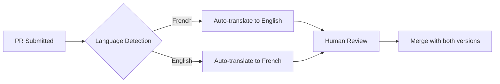

# 🌍 Multilingual Development Guide - PaniniFS

## 🎯 **Language Philosophy**

**PaniniFS embraces multilingual collaboration while maintaining accessibility for all contributors.**

### **Core Languages**
- **🇫🇷 Français** : Primary development language
- **🇺🇸 English** : International collaboration
- **🕉️ Sanskrit** : Linguistic research foundation

### **🤖 AI Translation Integration** (Coming Soon)
We're developing an AI-powered translation agent integrated into our PR workflow to ensure seamless collaboration regardless of language preference.

## 📝 **Current Language Support**

### **✅ Bilingual Documentation**
| Document | Français | English | Status |
|----------|----------|---------|--------|
| README | ✅ | ✅ | Complete |
| CONTRIBUTING | ✅ | ✅ | Complete |
| PR Template | ✅ | ✅ | Complete |
| Issue Templates | ✅ | 🔄 | In Progress |
| Security Policy | ✅ | 🔄 | In Progress |

### **📋 Contribution Guidelines**

#### **For French Speakers**
- **Preferred**: Contribute in French
- **Code comments**: French encouraged
- **Documentation**: French first, English translation welcome
- **Issues/PRs**: French perfectly fine

#### **For English Speakers**  
- **Fully supported**: English contributions welcome
- **Code comments**: English perfectly acceptable
- **Documentation**: English contributions valued
- **Issues/PRs**: English preferred for international visibility

#### **For Other Languages**
- **Issues/PRs**: English recommended for broader community understanding
- **Documentation**: Translation contributions highly valued
- **Research**: Multilingual sources and perspectives welcome

## 🔄 **Translation Workflow** (Current)

### **Manual Translation Process**
1. **Original content** created in French or English
2. **Community translation** by bilingual contributors
3. **Review process** for accuracy and technical terminology
4. **Maintenance** of both versions during updates

### **🤖 Automated Translation** (Roadmap)


## 🛠️ **Technical Implementation**

### **Code Comments Strategy**
```rust
// French primary with English in parentheses
// Compression des dhātu (dhātu compression)
fn compress_dhatu(input: &str) -> Result<Vec<u8>, Error> {
    // Analyse sémantique (semantic analysis)
    let semantic_tokens = analyze_semantics(input)?;
    
    // Application des transformations (apply transformations)
    transform_to_dhatu(semantic_tokens)
}
```

```python
# English primary with French context when needed
# Dhātu detection using Pāṇini principles
def detect_dhatu_patterns(text: str) -> List[DhatuPattern]:
    """
    Detect informational dhātu patterns in text.
    
    Uses the 7 fundamental dhātu discovered:
    1. Intentionality (Intentionnalité)
    2. Transformation (Transformation)
    ...
    """
```

### **Documentation Standards**
- **Headers**: Bilingual when possible
- **Examples**: Include both French and English samples
- **Technical terms**: Define in both languages
- **Error messages**: Bilingual when user-facing

## 🌍 **Community Contributions**

### **Translation Contributors**
We welcome community translations for:
- **Documentation expansion**
- **Error messages**
- **User interface elements**
- **Tutorial content**

### **Cultural Perspectives**
- **Sanskrit research**: Native knowledge highly valued
- **Linguistic analysis**: Multilingual perspectives essential
- **Use cases**: International context appreciated

## 🚫 **What NOT to Do**

### **Avoid**
- **Language barriers**: Don't feel restricted by language preference
- **Over-translation**: Not every comment needs bilingual version
- **Cultural assumptions**: Consider international audience
- **Technical jargon**: Define specialized terms clearly

### **Be Mindful Of**
- **Context clarity**: Ensure meaning clear in both languages
- **Technical precision**: Maintain accuracy across translations
- **Cultural sensitivity**: Respect diverse perspectives
- **Accessibility**: Consider non-native speakers

## 🤖 **AI Assistant Multilingual Usage**

### **Copiloting in Multiple Languages**
```bash
# French-speaking developer with AI
git commit -m "feat(core): amélioration compression dhātu

Développement assisté par IA en français
Co-authored-by: AI Assistant (French copiloting session)
Validation: Tests bilingues FR/EN"

# English-speaking developer with AI
git commit -m "feat(core): enhanced dhātu compression

AI-assisted development in English  
Co-authored-by: AI Assistant (English copiloting session)
Validation: Bilingual FR/EN tests"
```

### **Translation Assistance**
- **Use AI** for initial translations
- **Human review** for technical accuracy
- **Community validation** for cultural appropriateness

## 📞 **Support & Questions**

### **Language Preferences**
- **🇫🇷 French questions**: Perfectly welcome in issues/discussions
- **🇺🇸 English questions**: Encouraged for international collaboration
- **🌍 Other languages**: English recommended, but we'll try to help

### **Getting Help**
- **Documentation**: Check both FR/EN versions
- **Community**: Discussions welcome in both languages
- **AI assistance**: Available for translation help

---

## 🎯 **Future Vision**

**We're building toward a truly multilingual development environment where:**
- **Language barriers** don't limit contribution
- **Cultural diversity** enriches the project
- **AI translation** enables seamless collaboration
- **Technical precision** is maintained across languages

**Join us in creating this inclusive, multilingual open-source community! 🌍**

---

### 📧 **Contact**
- **Questions**: Open an issue or discussion
- **Translation help**: Community contributions welcome
- **Language support**: We're here to help regardless of your preferred language

**Bienvenue! Welcome! Swāgatam! 🙏**
