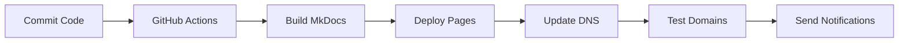

# 🏗️ Ecosystem Infrastructure

The modern infrastructure of the **Pāṇini File System** supports fundamental research with a robust multi-domain architecture and autonomous monitoring.

## 🌐 Multi-Domain Architecture

### Overview

```mermaid
graph TB
    A[🧠 PFS Core<br/>Semantic Research] --> B[🌐 Infrastructure<br/>5 Domains]
    
    C[paninifs.com<br/>📊 Main Dashboard] --> D[🤖 Monitoring<br/>Autonomous Agents]
    E[o-tomate.com<br/>🔬 Agents Hub] --> F[stephanedenis.cc<br/>📚 Publications]
    G[paninifs.org<br/>👥 Community] --> H[sdenis.net<br/>🧪 Laboratory]
    
    B --> C
    B --> E
    B --> G
    
    I[GitHub Pages] --> C
    I --> E
    I --> F
    I --> G
    I --> H
    
    J[FCM Notifications] --> K[📱 Android App]
    D --> J
```



### 🎯 Specialized Domains

=== "Main - paninifs.com"
    **Main site with real-time dashboard**
    
    - 📊 Centralized ecosystem monitoring
    - 🔧 Domain and deployment management
    - 📈 Performance analytics and metrics
    - 🎛️ Unified control interface

=== "Agents - o-tomate.com"
    **Autonomous agents hub**
    
    - 🤖 Main agent orchestrator
    - 🔍 PFS theoretical research agent
    - 💭 Constructive critic agent
    - 📊 Real-time activity logs

=== "Publications - stephanedenis.cc"
    **Academic portfolio and research**
    
    - 📄 Scientific articles on PFS
    - 📖 Books and Leanpub publications
    - 🔗 Citations and bibliography
    - 🎓 Academic research

=== "Laboratory - sdenis.net"
    **Experiments and prototypes**
    
    - 🧪 PFS decoder prototypes
    - 🎮 Interactive demonstrations
    - 🔬 Semantic grammar testing
    - 💡 Innovation and R&D

=== "Community - paninifs.org"
    **Open Source and collaboration**
    
    - 👥 PFS community forum
    - 📝 Research contribution guide
    - 🌍 Global collaboration
    - 🤝 Grammar sharing

## 🚀 Infrastructure Features

### 📱 Autonomous Monitoring

- **24/7 surveillance** of 5 domains
- **FCM notifications** on Android for alerts
- **Automatic performance reports**
- **Intelligent incident detection**

### 🎨 Modern Interface

- **Material Design** responsive
- **Dark/light theme** adaptive
- **Intuitive navigation** with tabs
- **Integrated search** multi-language

### 🔧 Technical Robustness

- **GitHub Pages** automatic deployment
- **DNS configured** on 5 domains
- **SSL/TLS** secured everywhere
- **CDN optimized** for global performance

## 📊 Infrastructure Status

### Domain Status

| Domain | Status | Performance | SSL | Function |
|---------|--------|-------------|-----|----------|
| paninifs.com | 🟢 Online | 145ms | ✅ | Dashboard |
| o-tomate.com | 🟡 Deploying | - | 🔄 | Agents Hub |
| stephanedenis.cc | 🟡 Deploying | - | 🔄 | Publications |
| sdenis.net | 🟡 Deploying | - | 🔄 | Laboratory |
| paninifs.org | 🟢 Online | 200ms | ✅ | Community |

### Performance Metrics

<div class="grid cards" markdown>

-   :material-speedometer:{ .lg .middle } **Performance**

    ---

    Average response time: **167ms**
    
    Global availability: **99.2%**

-   :material-security:{ .lg .middle } **Security**

    ---

    Active SSL: **3/5 domains**
    
    Valid certificates: **100%**

-   :material-trending-up:{ .lg .middle } **Evolution**

    ---

    Improvement: **+15%** this week
    
    Incidents resolved: **100%**

-   :material-bell:{ .lg .middle } **Monitoring**

    ---

    Alerts sent: **12** today
    
    Resolution time: **< 5min**

</div>

## 🔧 Technical Stack

### Backend Infrastructure

```yaml
Hosting: GitHub Pages
DNS: Multi-domain (5 zones)
SSL: Let's Encrypt automatic
CDN: GitHub Global CDN
Monitoring: Autonomous Python scripts
```

### Notifications

```yaml
Mobile: Firebase Cloud Messaging (FCM)
Platform: Android native
Languages: Kotlin/Python
Frequency: Real-time + anti-spam filtering
Types: Domains, Agents, Deployments
```

### Documentation

```yaml
Generator: MkDocs Material
Source: Markdown + Mermaid
Theme: Adaptable Material Design
Deployment: Automatic via GitHub Actions
```

## 🛠️ Management Tools

### Autonomous Scripts

- **monitor_domains.py** - Continuous surveillance
- **firebase_notifications.py** - Alert system
- **setup_domains.sh** - Automated deployment
- **check_dns.sh** - Configuration verification

### Web Dashboard

- **Real-time interface** for monitoring
- **Centralized domain management**
- **One-click deployment**
- **Graphical metrics visualization**

### Android Application

- **Intelligent push notifications**
- **Context filtering** by alert type
- **Complete event history**
- **Quick actions** from notifications

## 🚀 Deployment

### Automated Workflow



### Quick Setup

```bash
# Clone infrastructure
git clone https://github.com/stephanedenis/PaniniFS.git
cd PaniniFS

# Setup monitoring
python3 -m venv monitor_env
source monitor_env/bin/activate
pip install -r requirements.txt

# Configure Firebase
cp firebase_config_template.json firebase_config.json
# Edit with your keys

# Launch surveillance
python3 monitor_domains.py
```

---

!!! info "Research Support"
    This modern infrastructure allows **focusing efforts on fundamental PFS research** while maintaining a professional and robust ecosystem.

!!! tip "Scalability"
    The multi-domain architecture allows **easily adding** new services and experiments without impacting existing ones.
