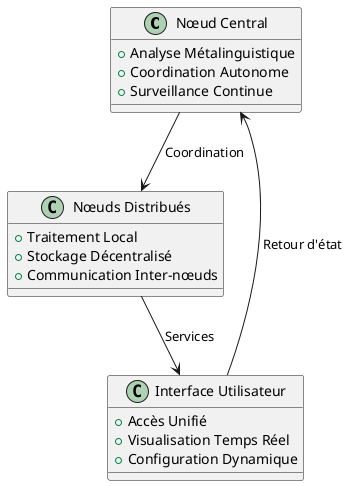

# Pāṇini File System

## Qu'est-ce que Pāṇini ?

Le système Pāṇini File System (PFS) est un système distribué autonome de traitement métalinguistique de l'information. Inspiré des travaux du grammairien sanskrit Pāṇini, il applique des principes structurels rigoureux à l'organisation et au traitement des données.

## Fondements Théoriques

### Approche Métalinguistique

Le PFS traite l'information selon des règles formelles dérivées de la grammaire générative de Pāṇini. Cette approche permet :

- **Structure cohérente** : Organisation systématique des données selon des règles grammaticales
- **Traitement contextuel** : Analyse du sens selon le contexte d'usage
- **Évolution adaptative** : Capacité d'apprentissage et d'adaptation autonome

### Architecture Distribuée

## Applications Pratiques

Le PFS trouve ses applications dans :

- **Gestion documentaire** : Organisation intelligente de corpus textuels
- **Systèmes autonomes** : Coordination de services distribués
- **Traitement linguistique** : Analyse et génération de contenu contextualisé
- **Infrastructure évolutive** : Adaptation dynamique aux besoins organisationnels

## Déploiement Multi-Domaines

Le système est déployé sur une infrastructure multi-domaines pour assurer la redondance et la performance :

- `paninifs.com` : Site principal et documentation
- `o-tomate.com` : Services expérimentaux
- `stephanedenis.cc` : Recherche et développement
- `sdenis.net` : Infrastructure technique
- `paninifs.org` : Communauté et ressources

## Surveillance Autonome

Le système intègre une surveillance continue avec notifications en temps réel via Firebase Cloud Messaging, assurant une disponibilité optimale et une réactivité aux incidents.

---

*Documentation technique détaillée disponible dans les sections Infrastructure et Surveillance.*
