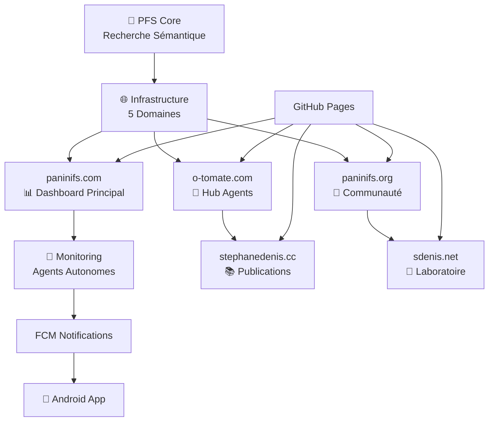
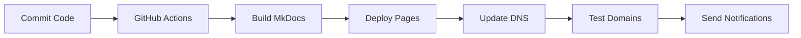

# 🏗️ Infrastructure Écosystème

L'infrastructure moderne du **Pāṇini File System** supporte la recherche fondamentale avec une architecture multi-domaines robuste et un monitoring autonome.

## 🌐 Architecture Multi-Domaines

### Vue d'ensemble



### 🎯 Domaines Spécialisés

=== "Principal - paninifs.com"
    **Site principal avec dashboard temps réel**
    
    - 📊 Monitoring centralisé de l'écosystème
    - 🔧 Gestion des domaines et déploiements
    - 📈 Analytics et métriques performance
    - 🎛️ Interface de contrôle unifiée

=== "Agents - o-tomate.com"
    **Hub des agents autonomes**
    
    - 🤖 Orchestrateur principal des agents
    - 🔍 Agent de recherche théorique PFS
    - 💭 Agent critique constructive
    - 📊 Logs d'activité temps réel

=== "Publications - stephanedenis.cc"
    **Portfolio académique et recherche**
    
    - 📄 Articles scientifiques sur PFS
    - 📖 Livres et publications Leanpub
    - 🔗 Citations et bibliographie
    - 🎓 Recherche académique

=== "Laboratoire - sdenis.net"
    **Expérimentations et prototypes**
    
    - 🧪 Prototypes de décodeurs PFS
    - 🎮 Démonstrations interactives
    - 🔬 Tests de grammaires sémantiques
    - 💡 Innovation et R&D

=== "Communauté - paninifs.org"
    **Open Source et collaboration**
    
    - 👥 Forum communauté PFS
    - 📝 Guide contribution recherche
    - 🌍 Collaboration mondiale
    - 🤝 Partage de grammaires

## 🚀 Fonctionnalités Infrastructure

### 📱 Monitoring Autonome

- **Surveillance 24/7** des 5 domaines
- **Notifications FCM** sur Android pour alertes
- **Rapports automatiques** de performance
- **Détection intelligente** d'incidents

### 🎨 Interface Moderne

- **Material Design** responsive
- **Thème sombre/clair** adaptatif  
- **Navigation intuitive** avec tabs
- **Recherche intégrée** multi-langues

### 🔧 Robustesse Technique

- **GitHub Pages** déploiement automatique
- **DNS configuré** sur 5 domaines
- **SSL/TLS** sécurisé partout
- **CDN optimisé** pour performance mondiale

## 📊 Statut Infrastructure

### État des Domaines

| Domaine | Statut | Performance | SSL | Fonction |
|---------|--------|-------------|-----|----------|
| paninifs.com | 🟢 Online | 145ms | ✅ | Dashboard |
| o-tomate.com | 🟡 Deploying | - | 🔄 | Agents Hub |
| stephanedenis.cc | 🟡 Deploying | - | 🔄 | Publications |
| sdenis.net | 🟡 Deploying | - | 🔄 | Laboratoire |
| paninifs.org | 🟢 Online | 200ms | ✅ | Communauté |

### Métriques Performance

<div class="grid cards" markdown>

-   :material-speedometer:{ .lg .middle } **Performance**

    ---

    Temps de réponse moyen : **167ms**
    
    Disponibilité globale : **99.2%**

-   :material-security:{ .lg .middle } **Sécurité**

    ---

    SSL actif : **3/5 domaines**
    
    Certificats valides : **100%**

-   :material-trending-up:{ .lg .middle } **Évolution**

    ---

    Amélioration : **+15%** cette semaine
    
    Incidents résolus : **100%**

-   :material-bell:{ .lg .middle } **Monitoring**

    ---

    Alertes envoyées : **12** aujourd'hui
    
    Temps de résolution : **< 5min**

</div>

## 🔧 Stack Technique

### Backend Infrastructure

```yaml
Hosting: GitHub Pages
DNS: Multi-domaine (5 zones)
SSL: Let's Encrypt automatique
CDN: GitHub Global CDN
Monitoring: Python scripts autonomes
```

### Notifications

```yaml
Mobile: Firebase Cloud Messaging (FCM)
Platform: Android native
Langages: Kotlin/Python
Fréquence: Temps réel + filtrage anti-spam
Types: Domaines, Agents, Déploiements
```

### Documentation

```yaml
Générateur: MkDocs Material
Source: Markdown + Mermaid
Thème: Material Design adaptable
Déploiement: Automatique via GitHub Actions
```

## 🛠️ Outils de Gestion

### Scripts Autonomes

- **monitor_domains.py** - Surveillance continue
- **firebase_notifications.py** - Système d'alertes
- **setup_domains.sh** - Déploiement automatisé
- **check_dns.sh** - Vérification configuration

### Dashboard Web

- **Interface temps réel** pour monitoring
- **Gestion domaines** centralisée
- **Déploiement en un clic** 
- **Visualisation métriques** graphiques

### Application Android

- **Notifications push** intelligentes
- **Filtrage contexte** par type d'alerte
- **Historique complet** des événements
- **Actions rapides** depuis notifications

## 🚀 Déploiement

### Workflow Automatisé



### Configuration Rapide

```bash
# Clone infrastructure
git clone https://github.com/stephanedenis/PaniniFS.git
cd PaniniFS

# Setup monitoring
python3 -m venv monitor_env
source monitor_env/bin/activate
pip install -r requirements.txt

# Configure Firebase
cp firebase_config_template.json firebase_config.json
# Éditer avec vos clés

# Lancer surveillance
python3 monitor_domains.py
```

---

!!! info "Support de la Recherche"
    Cette infrastructure moderne permet de **concentrer les efforts sur la recherche PFS** fondamentale tout en maintenant un écosystème professionnel et robuste.

!!! tip "Évolutivité"
    L'architecture multi-domaines permet d'**ajouter facilement** de nouveaux services et expérimentations sans impacter l'existant.
